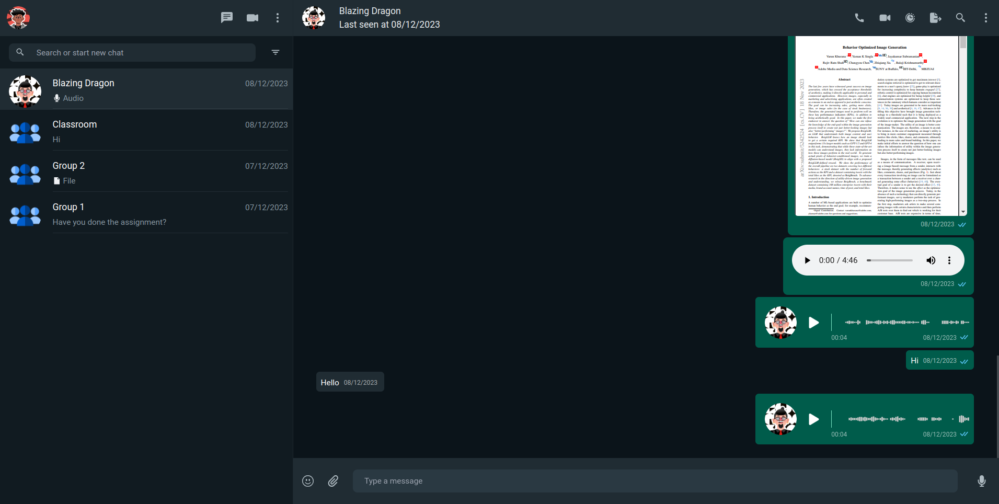

# SmileChat

SmileChat is a comprehensive web development project that offers a feature-rich chatting experience, developed using Next.js, Node.js, Tailwind, Prisma Client, Firebase, and Agora RTC Web Client. This platform provides a variety of functionalities to enhance communication and interaction among users.



## Features

1. **Video Conferencing**: Conduct video conferences seamlessly with support for multiple users.

2. **Sign Up or Login**: Users can create accounts or log in to access the platform.

3. **Push Notifications**: Receive browser or app push notifications for important updates and messages.

4. **Profile Customization**: Personalize user profiles with customizable options.

5. **Last Seen Status**: See when other users were last active on the platform.

6. **Export Chat as Txt**: Easily export chat conversations as text files for future reference.

7. **Dark and Light Modes**: Choose between dark and light themes for personalized visual preferences.

8. **Text Chat**: Engage in real-time text-based conversations with other users.

9. **Audio Messaging**: Record and send audio messages within the chat interface.

10. **Message Disappearing**: Set messages to disappear after a certain period, similar to WhatsApp's feature.

11. **File Transfer**: Share various file types, including PDFs, MP3s, images, and more, with other users.

12. **Group Chat**: Create and participate in group chats, similar to WhatsApp groups, for collaborative discussions.

## Getting Started

To get started with SmileChat, follow these steps:

1. Clone the repository:
   ```
   git clone https://github.com/Atul-AI08/smilechat.git
   ```

2. Navigate to the project directory:
   ```
   cd smilechat
   ```

3. Install dependencies using Yarn:
   ```
   yarn install
   ```

4. Set up Prisma for database operations. Ensure you have a PostgreSQL or MySQL database running locally or remotely.

   - Initialize Prisma in your project:
     ```
     npx prisma init
     ```

   - Configure your database connection in the `prisma/schema.prisma` file.

   - Generate Prisma Client:
     ```
     npx prisma generate
     ```
   - Generate all the required tables:
     ```
     npx prisma db push
     ```

5. Set up necessary configurations for Firebase and Agora RTC.

6. Build and run the project:
   - For client
   ```
   yarn dev
   ```
   - For server
   ```
   yarn start
   ```

7. Access the SmileChat platform in your web browser.

## License

This project is licensed under the [MIT License](LICENSE).